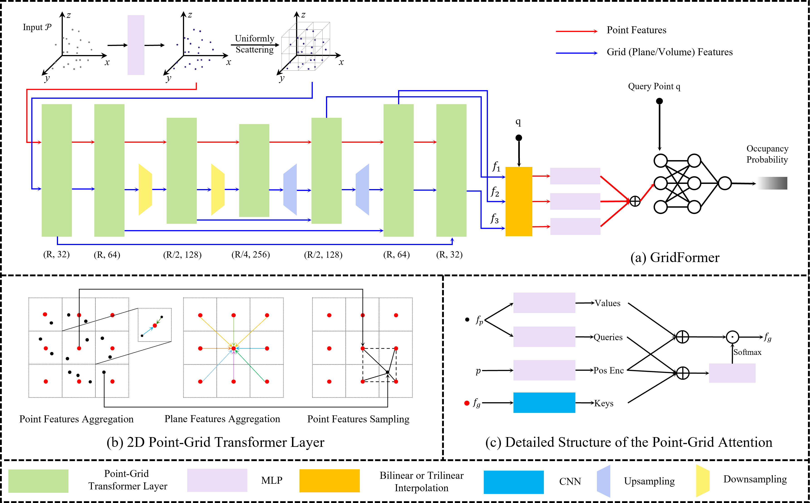

# GridFormer: Point-Grid Transformer for Surface Reconstruction
[**Paper**]() <br>

<div style="text-align: center">

<div>Overview of our method.</div>
</div>

This repository contains the implementation of the paper:

GridFormer: Point-Grid Transformer for Surface Reconstruction

If you find our code or paper useful, please consider citing
```bibtex
@inproceedings{li2024GridFormer,
      title={GridFormer: Point-Grid Transformer for Surface Reconstruction},
      author={Li, Shengtao and Gao, Ge and Liu, Yudong and Liu, Yu-Shen and Gu, Ming},
      booktitle={Proceedings of the AAAI Conference on Artificial Intelligence},
      year={2024}
    }
```

## Installation
You can create an anaconda environment called `gridformer` using
```
conda env create -f environment.yaml
conda activate gridformer
pip install -r requirements.txt
```

Next, compile the extension modules.
You can do this via
```
python setup.py build_ext --inplace
```

## Dataset
### ShapeNet
You can download the dataset (73.4 GB) by running the [script](https://github.com/autonomousvision/occupancy_networks#preprocessed-data) from Occupancy Networks. After, you should have the dataset in `data/ShapeNet` folder.  


### Synthetic Indoor Scene Dataset

You can download the preprocessed data (144 GB) using

```
bash scripts/download_data.sh
```

This script should download and unpack the data automatically into the `data/synthetic_room_dataset` folder.  


### ScanNet
Download ScanNet v2 data from the [official ScanNet website](https://github.com/ScanNet/ScanNet).
Then, you can preprocess data with:
`scripts/dataset_scannet/build_dataset.py` and put into `data/ScanNet` folder.  


### Boundary Sampling
We provide the boundary sampling python script for ShapeNet. You can run it with the preprocessed dataset used in [ConvONet](https://github.com/autonomousvision/convolutional_occupancy_networks) by:
```
python scripts/boundary_sampling.py
``` 

For other datasets or your own data, just change the path in the script.


## Experiments
### Training
Stage 1:
```
python train.py CONFIG.yaml
```

Stage 2:
```
python refine.py CONFIG.yaml
```

For available training options, please take a look at `configs/default.yaml`.

### Mesh Generation
To generate meshes using a trained model, use
```
python generate.py CONFIG.yaml
```
where you replace `CONFIG.yaml` with the correct config file.


### Evaluation
For evaluation of the models, we provide the script `eval_meshes.py`. You can run it using:
```
python eval_meshes.py CONFIG.yaml
```
The script takes the meshes generated in the previous step and evaluates them using a standardized protocol. The output will be written to `.pkl/.csv` files in the corresponding generation folder which can be processed using [pandas](https://pandas.pydata.org/).

### Acknowledgement 
The code is largely based on [ConvONet](https://github.com/autonomousvision/convolutional_occupancy_networks) and [ALTO](https://github.com/wzhen1/ALTO). Many thanks to the authors for opensourcing the codebase. 
